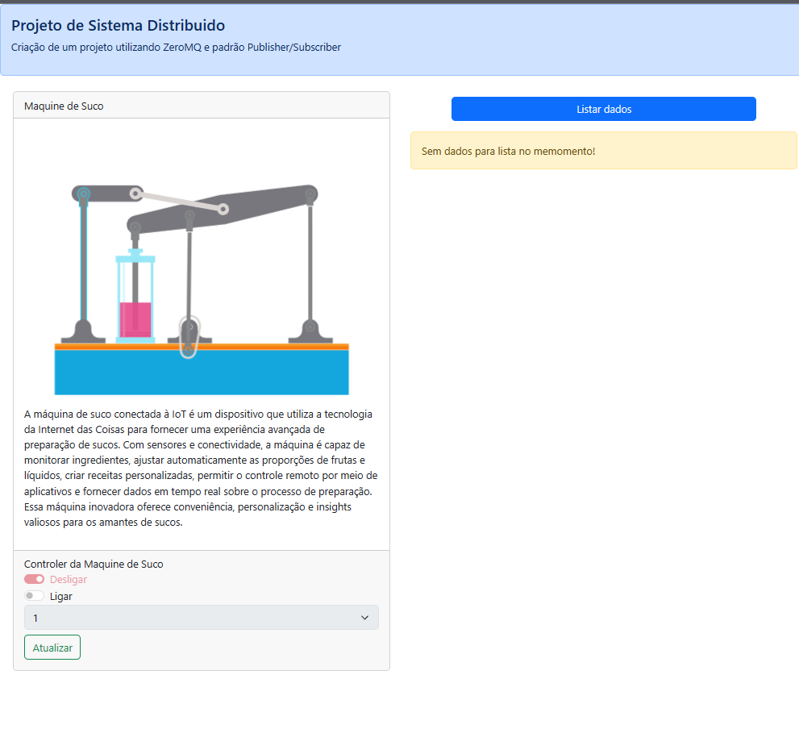

<h1 align="center">Project Distributed System</h1>

## 🧪 Tecnologias utilizadas

Ferramentas necessarias para exercutar o projeto

- Node.js v18.12.1
- NPM
- IDE (vs code)
- Git

## 💻 Projeto

Clone o repositório do projeto

```
git clone https://github.com/erikbernard/pub_sub_distributed_system.git
```

Acesse a pasta do projeto

```
cd ./pub_sub_distributed_system
```

## Instalação das dependências do backend

acesse a pasta do backend e diggito o comando

```
cd ./backend
npm install
```

E depois execute

```
npm run ts:server
```

Aparecerá a seguinte mensagem no terminal demonstrar que está tudo ok.

```
Subscriber connected to port 3000
Publisher bound to port 3000
```

## Instalação das dependências do frontend

acesse a pasta do frontend e diggito o comando

```
cd ./frontend
npm install
```

E depois execute

```
npm run dev
```

A seguinte mensagem está tudo ok. agora acesso o link para visualiza aplicação.

```
  ➜  Local: http://localhost:5173/
  ➜  Network: use --host to expose
  ➜  press h to show help

```

## O front end

A maquina vai começa desligada, para inicia as atividades ligue a maquina e atualize, posteriormente pode listar os dados e monitorar as atividades da maquina.



## O Back end

No back end será mostrado os logs do dados.
